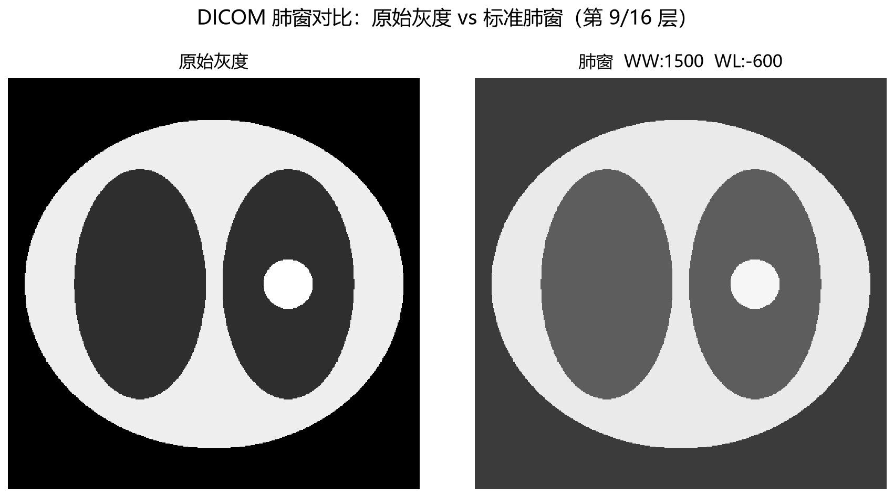

# LungWindow — DICOM CT 肺窗图像处理工具

基于 Python 的医学影像处理命令行工具，专注于 **DICOM CT 影像的窗宽窗位（Window Width / Window Level）转换**：读取 DICOM 原始 HU 值，按标准肺窗或自定义窗宽窗位参数映射为 8 位灰度图并导出 PNG。

---

## 项目简介

CT 影像的 HU（Hounsfield Unit）值动态范围可达 `[-1024, 3071]`，远超显示器的 256 级灰度，直接显示会丢失大部分组织对比度。本项目实现标准的窗宽窗位转换算法，将医生关心的 HU 区间线性拉伸到 `[0, 255]`，从而清晰呈现肺纹理、磨玻璃结节等低对比度结构。

项目提供：

- **命令行接口**（`main.py`）：一条命令完成「读取 DICOM → 窗宽窗位转换 → 导出 PNG」，适合批处理与脚本集成
- **核心算法库**（`core/`）：纯函数化的 HU 转换、窗位映射、图像导出，职责单一、便于复用与测试
- **完整单元测试**（`tests/`）：覆盖正常路径与异常边界，保证算法健壮性

## 技术栈

| 库 | 用途 |
|---|---|
| Python 3.9+ | 主语言（已在 3.13 验证通过） |
| pydicom | DICOM 文件读取与元数据解析 |
| numpy | HU 矩阵运算与窗位映射 |
| Pillow | PNG 图像编码与导出 |
| pytest | 单元测试框架 |

## 核心原理

### 窗宽窗位的医学意义

- **窗宽（WW, Window Width）**：显示窗口覆盖的 HU 值范围。窗宽越大，对比度越低，但能同时看清密度差异较大的组织；窗宽越小，对比度越高、细节越锐利。
- **窗位（WL, Window Level / Center）**：窗口中心的 HU 值，决定哪一段 HU 被映射为中间灰度，效果类似亮度调节。

### 像素映射公式

```
low  = WL - WW / 2
high = WL + WW / 2
gray = clip((HU - low) / (high - low), 0, 1) × 255
```

低于窗下限的像素裁剪为 0（纯黑），高于窗上限的像素裁剪为 255（纯白），越界像素"饱和"到灰度两端，不会溢出。

### 肺窗示例

标准肺窗 `WW=1500, WL=-600` 覆盖 HU `[-1350, +150]`：含气肺组织（约 `-800 HU`）落在暗灰区，纵隔软组织（约 `+30~+50 HU`）落在亮区，从而在低密度背景下清晰显示肺部病变。

## 功能特性

- **DICOM 解析**：读取 `.dcm` 文件，按 `RescaleSlope / RescaleIntercept` 还原 HU 值
- **标准肺窗转换**：内置 `WW=1500, WL=-600` 默认参数，一键输出肺窗图像
- **自定义窗位参数**：`-w / -l` 支持任意窗宽窗位（如纵隔窗 `400 / 40`）
- **单元测试覆盖**：20 个测试覆盖窗位映射、边界裁剪、多窗位、异常输入等场景

## 效果展示

下图左侧为 **DICOM 原始灰度**直接映射，右侧为 **标准肺窗**（`WW=1500, WL=-600`）处理结果：



可以看到，原始灰度下含气肺组织与背景空气的对比度不足；应用肺窗后，肺纹理与病灶结节的轮廓更加清晰。

## 使用教程

### 环境准备

```bash
# 建议使用虚拟环境
python -m venv .venv
source .venv/bin/activate          # Windows: .venv\Scripts\activate

pip install -r requirements.txt
```

> 无真实 DICOM 数据时可先生成合成演示样本：
> ```bash
> python scripts/make_phantom.py    # 生成 sample_data/lung_phantom.dcm
> ```

### 命令行调用

```bash
# 1. 默认参数（标准肺窗 WW=1500, WL=-600），输出与输入同目录同名 .png
python main.py -i sample_data/lung_phantom.dcm

# 2. 自定义窗宽窗位（纵隔窗 WW=400, WL=40）
python main.py -i sample_data/lung_phantom.dcm -w 400 -l 40

# 3. 指定输出路径
python main.py -i input.dcm -w 1500 -l -600 -o output/lung.png
```

参数说明：

| 参数 | 说明 | 默认值 |
|---|---|---|
| `-i, --input` | DICOM 文件路径（必填） | — |
| `-w, --ww` | 窗宽 | `1500` |
| `-l, --wl` | 窗位 | `-600` |
| `-o, --output` | 输出 PNG 路径 | 输入同目录、同名 `.png` |

处理完成后，控制台会输出窗宽窗位参数、图像尺寸、HU 值范围与输出路径。

> 交互式界面：项目同时保留了基于 Streamlit 的 Web 界面（`streamlit run app.py`），可交互调节窗宽窗位、标注病灶并实时查看，适合探索式分析；命令行接口则适合批处理与脚本集成。

## 测试说明

```bash
pytest
```

共 **20 个单元测试**，覆盖：

- **窗宽窗位转换**：标准肺窗、纵隔窗的理论值验证（允许 uint8 精度误差）
- **边界裁剪**：低于窗下限 / 高于窗上限的像素裁剪到 0 / 255
- **异常输入**：空数组、NaN / ±inf、非法窗宽（ww ≤ 0）
- **基础功能**：HU 转换、ROI 统计、DICOM 脱敏、PNG 导出、校验器等

测试使用代码内合成的 DICOM 数据集，无需真实影像数据即可运行。

## 项目亮点

- **算法精度**：窗位映射逐点符合理论值（误差 ≤ 1 灰度级），并有单元测试逐点验证
- **工程化结构**：`core / ui / scripts / tests` 分层清晰，核心算法纯函数化、可独立复用
- **测试体系**：20 个测试覆盖正常路径与异常边界，保证算法健壮性
- **医学场景适配**：内置标准肺窗 / 纵隔窗参数，处理流程遵循 DICOM 规范，兼顾隐私脱敏

## 许可证

MIT
