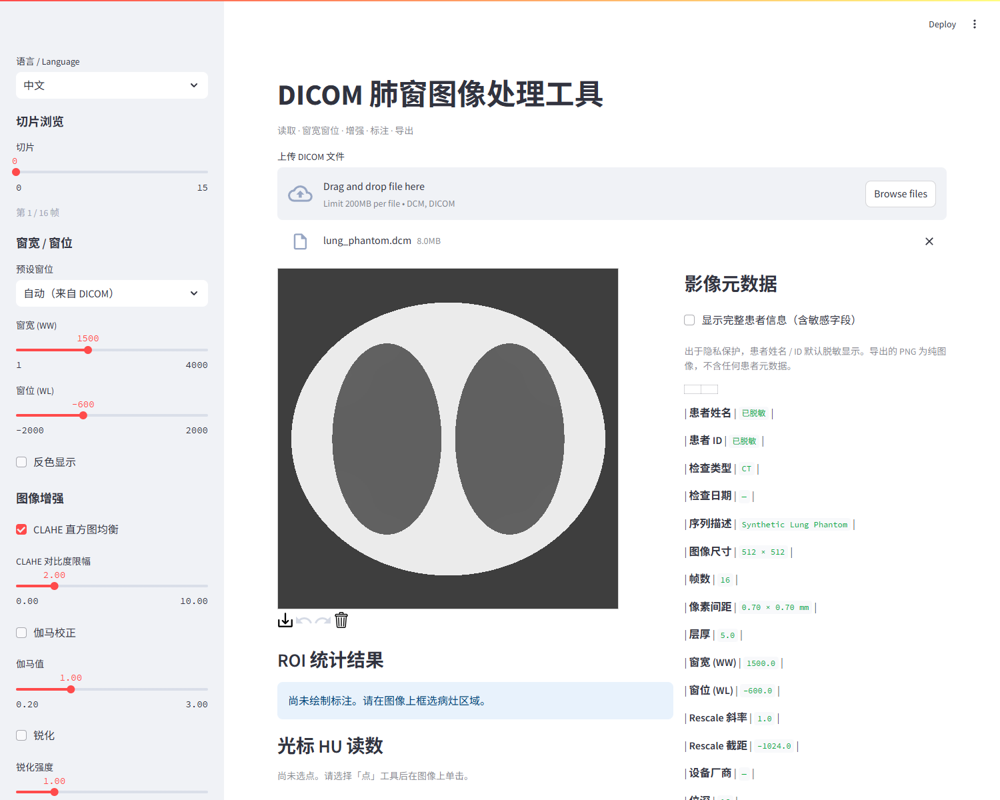
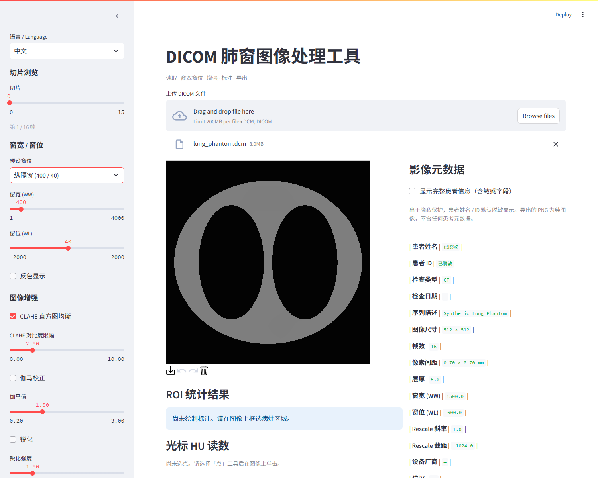
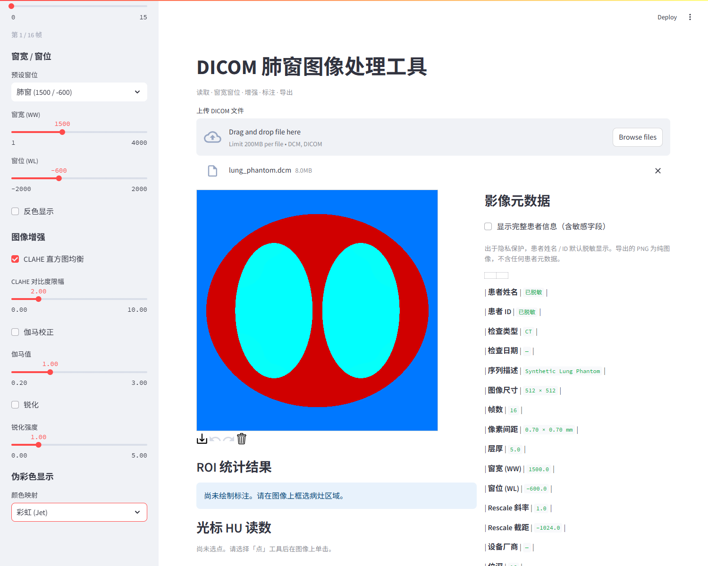
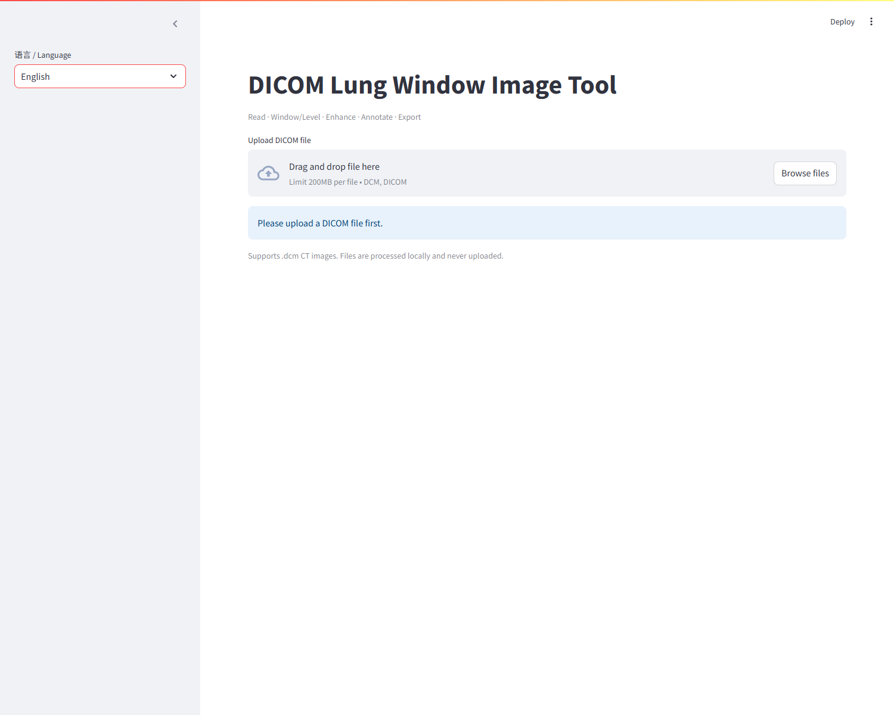
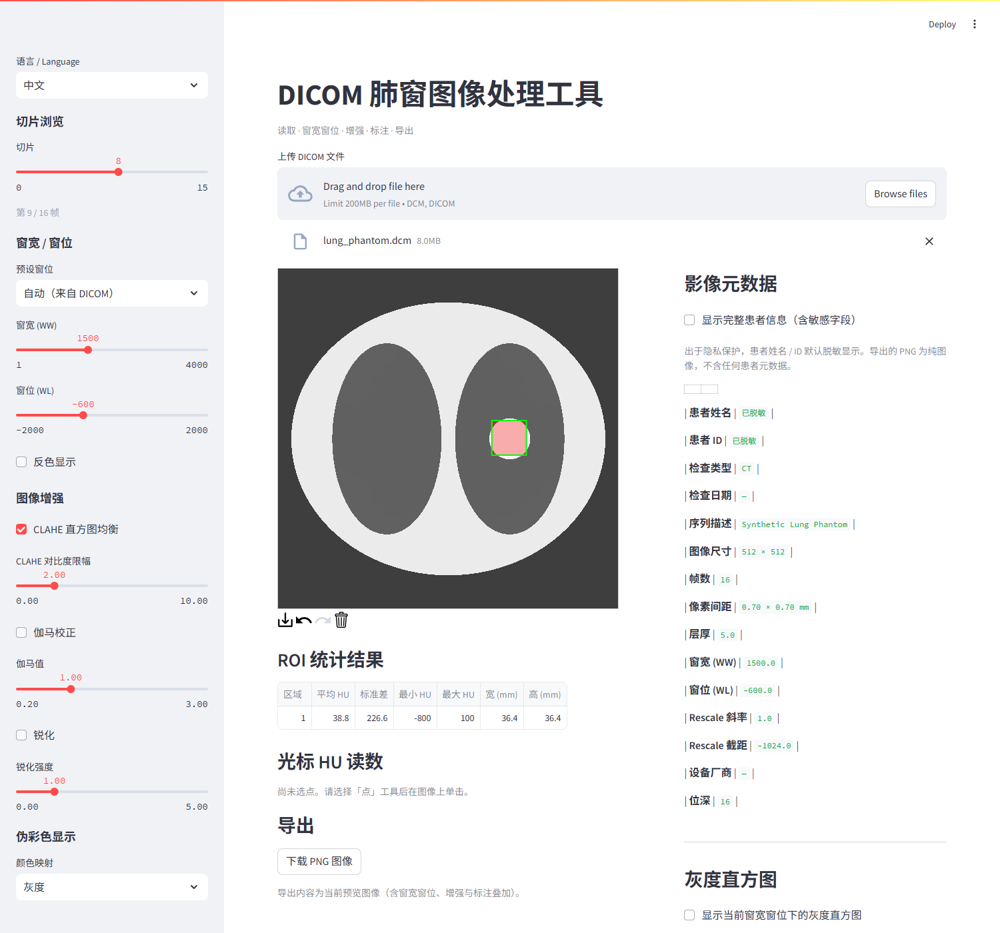
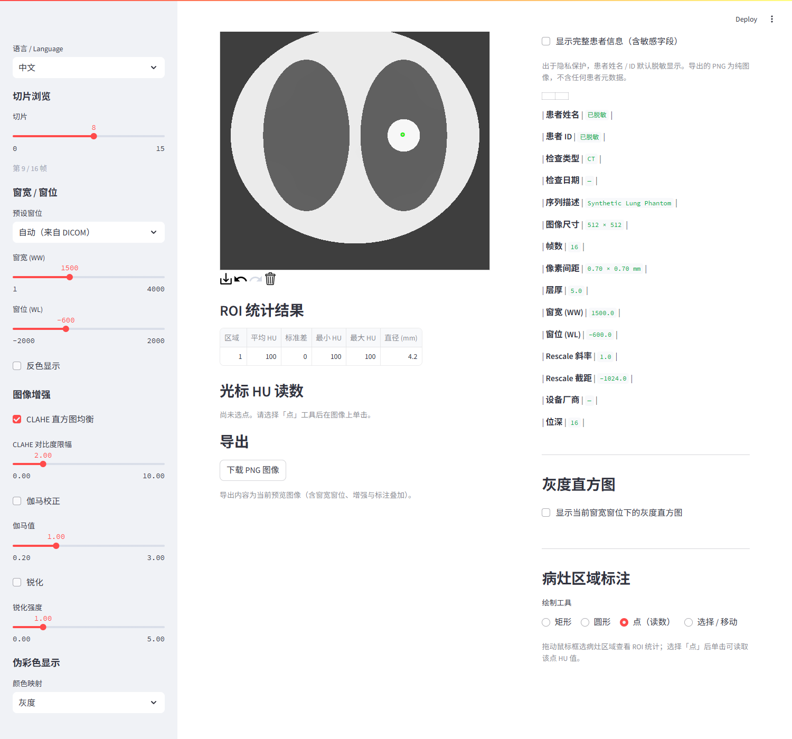

# 演示截图

以下截图均基于 `python scripts/make_phantom.py` 生成的合成肺 CT 幻影
（`sample_data/lung_phantom.dcm`，512×512 × 16 帧）上传后截取，
浏览器为 Microsoft Edge（Chromium），无真实患者数据。

> 复现方法：`streamlit run app.py` → 打开 http://localhost:8501 →
> 上传 `sample_data/lung_phantom.dcm`，按各图说明切换参数后截图。

## 1. 主界面 · 多层面浏览 + 自动窗位

上传后默认自动套用 DICOM 自带的窗宽窗位（肺窗 `1500 / -600`）：
- 左侧「窗宽窗位」区顶部出现 **自动 (1500 / -600)** 预设并默认选中；
- 「切片」滑块用于浏览 16 帧 CT 卷（当前帧指示 `1 / 16`）；
- 右侧为影像元数据面板，含分辨率、帧数、像素间距、层厚等。

## 2. 纵隔窗预设

切换到「纵隔窗 (400 / 40)」预设，软组织对比增强，胸腔轮廓更清晰。
同一影像在不同窗位下呈现不同细节，用于不同解剖结构的观察。

## 3. 伪彩色映射

侧边栏「伪彩色」选择「彩虹 (Jet)」，灰度窗位结果映射为伪彩色，
便于视觉上突出高 / 低密度区域。

## 4. 英文界面

侧边栏「语言 / Language」切换为 `English`，全界面文案（标题、控件、
元数据、提示）一键切换为英文。

## 5. 病灶标注 · ROI 统计

选择「矩形」工具框选右肺内的高密度结节（绿色边框 + 半透明填充），
下方「ROI 统计」表实时给出平均 HU、标准差、最小 / 最大值与毫米尺寸
（本例结节约 +100 HU，ROI 含结节与周边含气肺组织）。

## 6. 光标 HU 读数

选择「点（读数）」工具，单击图像任意像素，下方「光标 HU 读数」表
实时显示该点坐标与 HU 值（本例点击结节中心，读数约 +100 HU）。
